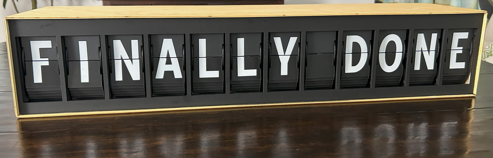
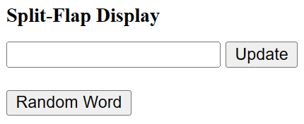
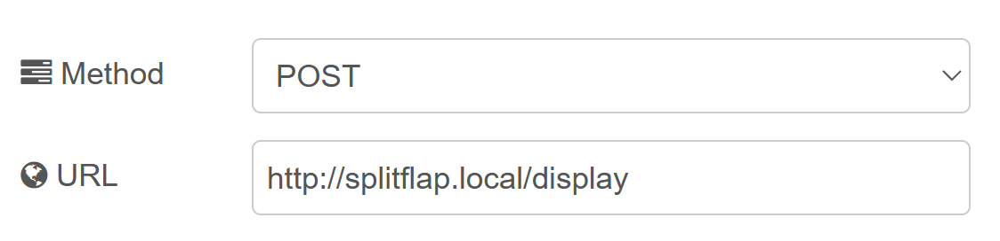
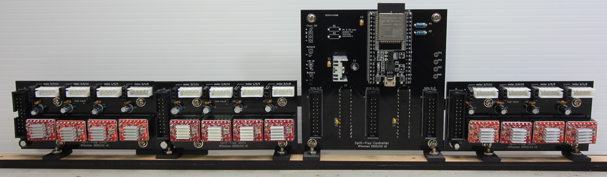
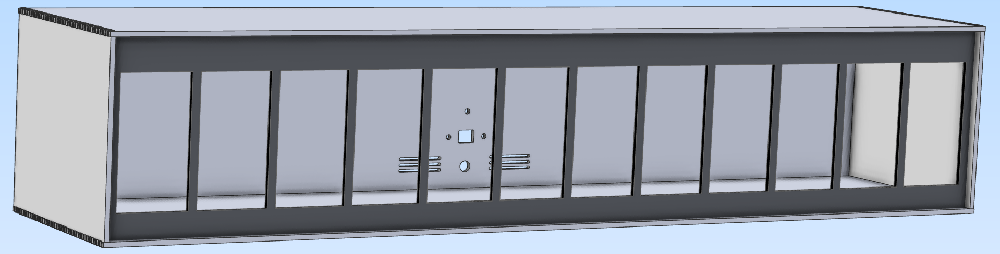
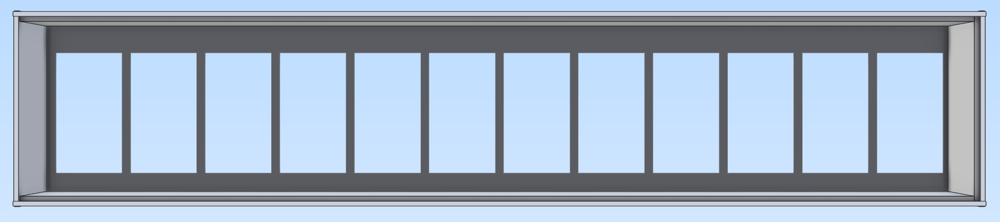

# Mechanical split-flap display
You can find full details and discussion on my [blog](https://tinkerwithtech.net/split-flap-display-brings-back-memories).


<br/>

This is an alternate electronics and firmware for David Kingsman's [Split-Flap Display](https://www.printables.com/model/69464-split-flap-display).

### Advantages
* Only one microprocessor is needed to drive a 12 character display, instead of the 13 microprocessors that would be required in the original design.
* Off-the-shelf ribbon cables are used between PCBs to reduce custom wiring.
* All components are through-hole mounted (i.e. no SMD).
* Overall, this should reduce assembly time and effort.

### Disadvantages
* PCBs are not mounted to the back of the display units but have their own mounting brackets. This approach is best suited for use in your own enclosure.
* A display of greater than 12 characters would require an additional controller board i.e. may not be as seamless as the original.
<br/><br/>

## Settings
### Turn on interactions and debugging over the USB serial port in [debug.h](include/debug.h):
DEBUG 1
<br/>
### Specify the number of Units (characters) in your display (4 -12) in [system.h](include/system.h):
unitCount = 12;
<br/>
### Customise for each unit for your build. (Units are numbered left to right 0 - 11) in [unit.h](include/unit.h):
calOffsetUnit : an array of the offsets to move from hall sensor trigger to blank flap<br/>
FlapStep : an array containing the number of steps per stepper revolution (then divided by 45 flaps)
<br/>
### Password and localisation settings in [config.h](include/config.h):
WIFI_SSID "mySSID"<br/>
WIFI_PWD "myPassword"

MY_NTP_SERVER "au.pool.ntp.org" // Set the best fitting NTP server (pool) for your location<br/>
MY_TZ "AEST-10AEDT,M10.1.0,M4.1.0/3" // Set your time zone from https://github.com/nayarsystems/posix_tz_db/blob/master/zones.csv

WORDNIKAPIKEY "" // Get your private key from https://developer.wordnik.com/<br/>
MINWORDLEN 9 // Specify minimum word length to fetch from Wordnik<br/>
WORDUPDATESPERHOUR 1 // Set number of word updates from https://wordnik.com per hour. 0 will disable, else use an integer that results in an exact number of minutes btw updates i.e. 1,2,3,4,5,6,10,12,15,20,30 or 60
<br/><br/>
## Libraries
This project makes extensive use of two libraries:
* [FastAccelStepper](https://github.com/gin66/FastAccelStepper) by J.Kiemes
* [arduino-mcp23017](https://github.com/blemasle/arduino-mcp23017) by Bertrand Lemasle
<br/><br/>

## Connecting to the display
### There is a very basic web page served at http://splitflap.local/ to allow you to either enter text to display or fetch a random word from Wordnik 


<br/>

### There is also an API endpoint that you can POST to at http://splitflap.local/display, using a JSON payload in the body:

```json
{
    displaytext: "Display Text"
}
```

For example, you could use the request node within node-red:

<br/>

<br/><br/>

## PCBs
<br/>

Schematics for the Controller and Unit PCBs can be found under [schematics](schematics/).

Gerbers, Bill of materials and Kicad source files can be found under [PCBs](PCBs/).
<br/><br/>

## Brackets & unit frames 3D printing
PCB mounting brackets can be found on [Printables](https://www.printables.com/model/805853-split-flap-display).<br/> Also found there is my remixed unit frame. This is optional, as you could still use the original frames with the new electronics.
My unit frame requires an additional two M3\*L3\*D4 heat inserts for connecting to the adjacent unit.
<br/><br/>

## Enclosure (laser cut)

front<br/>
<br/>

rear<br/>
<br/>


Plywood (3mm) files for laser cutting are in [enclosure](enclosure/)
<br/><br/>


## Licensing
Copyright (c) 2024 Malcolm Yeoman.<br/>

Electronics is released under [CERN-OHL-P (Permissive) V2](https://ohwr.org/cern_ohl_p_v2.pdf).<br/>
Firmware is released under the [MIT License](http://opensource.org/licenses/MIT).<br/>
Documentation is licensed under a [Creative Commons Attribution 4.0 International License](http://creativecommons.org/licenses/by-sa/4.0/).